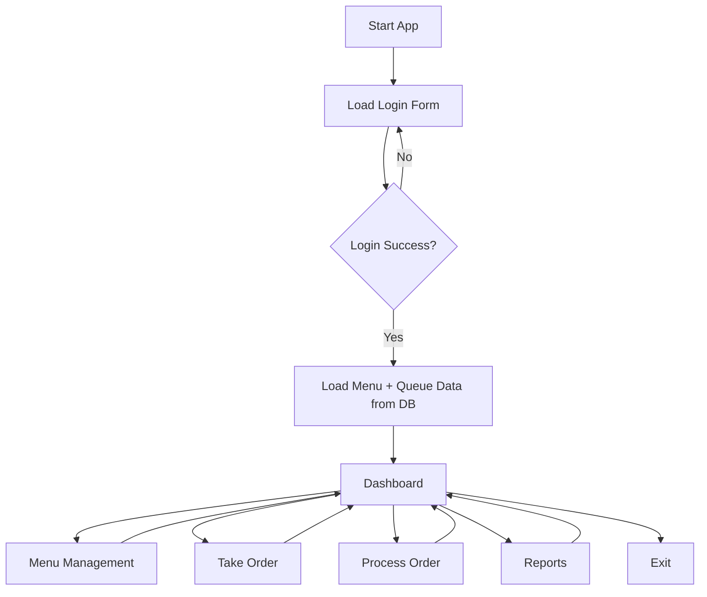
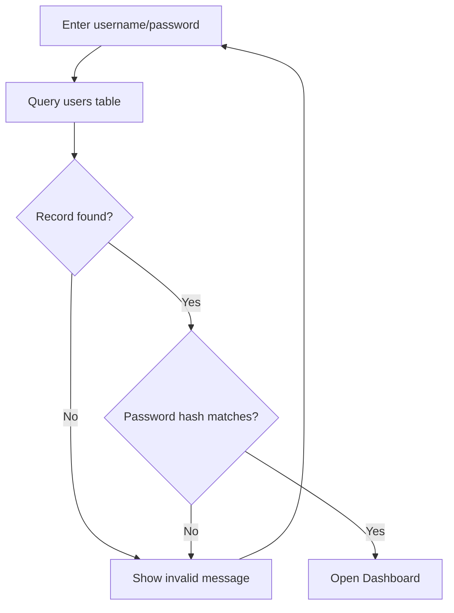
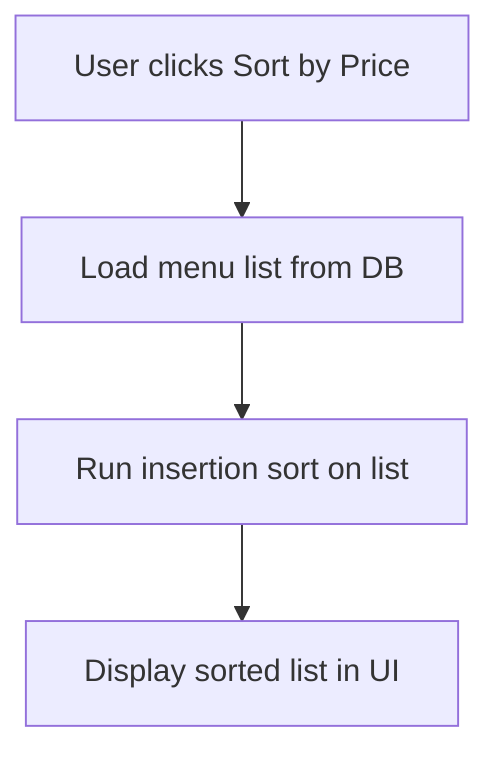

# Coffee Shop Management System – Offline Java/Swing + MySQL Design

## 1. High-Level System Overview
**Description:** A desktop Java Swing application (built in NetBeans) that runs entirely offline against a local MySQL instance. It supports staff/owner operations for menu management, order taking, order processing, billing, and reporting. Customers are served indirectly by staff entering orders.

**Main modules**
- **Login Module:** Swing login form; verifies username/password against the local MySQL `users` table via JDBC. Blocks all other modules until authentication succeeds.
- **Menu Management Module:** CRUD for menu items (coffee, pastries, etc.) stored in `menu_items`. Provides sorted views (by name/price/category) using insertion sort on in-memory data.
- **Order Management (Queue) Module:** Uses a custom Linked List–backed Queue to hold up to **50 active orders** (FIFO). Supports enqueue (new order), dequeue (serve next), traverse (list active queue), and linear search of active orders.
- **Billing/Payment Module:** Calculates totals, records payments, and updates order status in MySQL. Integrates with dequeue flow to mark served/paid.
- **Reports/History Module:** Loads historical orders/sales from MySQL, provides search (linear) and sorting (insertion sort) for lists such as daily sales.

**Offline handling:** All logic and data persist locally. Swing UI talks only to the local MySQL server (embedded/installed on the same machine). No network calls are required.

## 2. Database Model (Conceptual)
Tables (minimum):
- `users(user_id, username, password_hash, role)`
- `menu_items(item_id, code, name, category, price, status)`
- `orders(order_id, customer_name, order_time, status, total_amount)`
- `order_items(order_item_id, order_id, item_id, quantity, line_total)`
- `sales(sale_id, order_id, paid_time, total_amount, payment_method)`

**Data interaction:**
- On login/menu/order flows, records are retrieved via JDBC into in-memory objects (e.g., `List<MenuItem>` or queue of `Order`).
- Queue nodes reference `Order` objects loaded/created in memory; status changes are persisted back to `orders`/`sales` tables.
- Sorting and searching operate on in-memory collections (arrays/lists) populated from the database; after reorder, the UI displays the sorted collection (DB order unaffected).

## 3. Data Structures & Core Classes (Conceptual)
- `class User { int id; String username; String passwordHash; String role; }`
- `class MenuItem { int id; String code; String name; String category; double price; String status; }`
- `class OrderItem { MenuItem item; int quantity; double lineTotal; }`
- `class Order { int id; String customerName; LocalDateTime orderTime; String status; double totalAmount; List<OrderItem> items; }`
- `class Node { Order data; Node next; }` (for the linked list queue)
- `class OrderQueue {`
  - `Node front, rear; int size; final int MAX_SIZE = 50;`
  - `enqueue(Order order)`, `dequeue()`, `traverse()`, `isFull()`, `isEmpty()`
  - Uses linked list nodes; enforces `MAX_SIZE` before adding.
- `class OrderManager { OrderQueue activeQueue; DatabaseManager db; }`
  - Handles creating orders, pushing to queue, persisting to DB, linear search on queue/history.
- `class DatabaseManager { Connection getConnection(); CRUD for users/menu/orders; }`
- Utility functions: `linearSearchOrder(List<Order> list, predicate)`, `linearSearchMenu(List<MenuItem> list, predicate)`, `insertionSortMenu(List<MenuItem> list, Comparator)`, `insertionSortSales(List<Sale> list, Comparator)`.

## 4. Detailed Step-by-Step Algorithms (Pseudo-code)

### 4.1 User Login (Swing form + MySQL)
```
Input: usernameInput, passwordInput
On Login Button Click:
  connection = DatabaseManager.getConnection()
  result = SELECT password_hash FROM users WHERE username = usernameInput
  IF result is empty THEN
      show "Invalid username/password"
      return
  ENDIF
  IF hash(passwordInput) != result.password_hash THEN
      show "Invalid username/password"
      return
  ENDIF
  open MainDashboard()
```

### 4.2 Add New Menu Item (DB insert)
```
Input: code, name, category, price
Validate fields (non-empty, price > 0)
connection = DatabaseManager.getConnection()
EXECUTE INSERT INTO menu_items(code, name, category, price, status) VALUES(?,?,?,?, 'ACTIVE')
IF insert success THEN
    show "Menu item saved"
    refreshMenuListFromDB()
ELSE
    show error message
ENDIF
```

### 4.3 Take Customer Order + Enqueue (Linked List Queue)
```
Input: customerName, selectedMenuItems (with qty)
Compute totalAmount from item prices
Create Order object (status='PENDING', orderTime=now, items=selectedMenuItems)
connection = DatabaseManager.getConnection()
INSERT order into orders table (return order_id)
INSERT each order_item into order_items table (order_id FK)
Set Order.id = generated order_id
// Enqueue to active queue
IF OrderQueue.isFull() THEN
    show "Queue full (50 active orders). Cannot take new orders."
    return
ENDIF
OrderQueue.enqueue(Order)
show "Order added to queue"
```

### 4.4 Serve/Process Order (Dequeue + DB update + Payment)
```
IF OrderQueue.isEmpty() THEN
    show "No active orders"
    return
ENDIF
order = OrderQueue.dequeue()  // FIFO
Display order details for payment
Receive payment_method and confirmation
connection = DatabaseManager.getConnection()
UPDATE orders SET status='SERVED', total_amount=order.totalAmount WHERE order_id=order.id
INSERT INTO sales(order_id, paid_time, total_amount, payment_method) VALUES(order.id, now, order.totalAmount, payment_method)
show "Order served and paid"
```

### 4.5 Search Order (Linear Search in queue or history)
```
Function searchOrderById(targetId):
  list = OrderQueue.traverse()   // returns List<Order>
  FOR i FROM 0 TO list.size-1
     IF list[i].id == targetId THEN return list[i]
  END FOR
  return null
```
For history, load `orders` rows into a list first, then perform the same linear scan.

### 4.6 Search Menu Item (Linear Search)
```
Function searchMenuByName(targetName):
  list = loadMenuFromDB()
  FOR each item IN list
     IF item.name.equalsIgnoreCase(targetName) THEN return item
  END FOR
  return null
```

### 4.7 Sort Menu Items or Sales Records (Insertion Sort)
```
Function insertionSortMenuByPrice(List<MenuItem> list):
  FOR i FROM 1 TO list.size-1
     key = list[i]
     j = i - 1
     WHILE j >= 0 AND list[j].price > key.price
         list[j+1] = list[j]
         j = j - 1
     END WHILE
     list[j+1] = key
  END FOR
  return list
```
Trigger this when the user selects "Sort by Price/Name" in the UI. The list is prepared by loading menu records from MySQL into an ArrayList, then sorted in-memory and displayed.

## 5. Flow Diagrams (Mermaid)

### 5.1 Main System Flow


### 5.2 Login Flow


### 5.3 Take Order (Enqueue)
```mermaid
flowchart TD
    T1[Staff selects items + qty] --> T2[Calculate total]
    T2 --> T3[Create Order object]
    T3 --> T4[Insert order + items into MySQL]
    T4 --> T5{Queue full? size>=50}
    T5 -- Yes --> T6[Show queue full error]
    T5 -- No --> T7[OrderQueue.enqueue(order)]
    T7 --> T8[Confirm order added]
```

### 5.4 Process/Serve Order (Dequeue)
```mermaid
flowchart TD
    P1[Click Serve Next] --> P2{Queue empty?}
    P2 -- Yes --> P3[Show "No active orders"]
    P2 -- No --> P4[OrderQueue.dequeue()]
    P4 --> P5[Display order details]
    P5 --> P6[Receive payment method]
    P6 --> P7[Update orders status in DB]
    P7 --> P8[Insert sales record]
    P8 --> P9[Show success / print receipt]
```

### 5.5 Search Order (Linear Search)
```mermaid
flowchart TD
    S1[Enter order ID/name] --> S2[Load active queue list]
    S2 --> S3[Linear scan from front to rear]
    S3 --> S4{Match found?}
    S4 -- Yes --> S5[Show order details]
    S4 -- No --> S6[Show "Not found"]
```

### 5.6 Sort Records (Insertion Sort)


## 6. Desktop Swing UI Blueprint (Offline + Local MySQL)

### 6.1 Visual System
- **Theme:** Light canvas (#f6f7f9) with accent **#376092** for primary buttons, headers, and active navigation cards.
- **Shared components:**
  - Primary buttons with bold text, rounded corners, and hover highlight; secondary buttons in a soft gray background with accent text.
  - Toast-style status labels (success = green, error = red) placed under toolbars or inside dialogs.
  - Tables (`JTable`) for data grids wrapped in padded `JScrollPane`; modal dialogs (`JDialog`) for confirmations and payment capture.
- **Data access:** All screens read/write exclusively to the **local MySQL instance** via the `DatabaseManager`/`DatabaseAccess` layer. No network calls are performed; every search/sort works on in-memory lists populated from JDBC queries.

### 6.2 Login (All Users)
- **Layout:** Centered card with username/password fields, accent-colored “Sign In” button, and a helper label for status messages.
- **Validation:**
  - Empty username/password ➜ inline friendly warning (“Please enter both username and password.”) without hitting the database.
  - Invalid credentials ➜ error label in red (“Invalid username or password.”) after database check against the local `users` table.
- **Blocking behavior:** The dashboard frames remain disabled/hidden until authentication succeeds. On success, open the main dashboard and dispose the login window.

### 6.3 Owner / Manager Dashboard
- **Navigation:** Left sidebar or top cards for **Menu Management**, **Order Queue Monitor**, **Reports/History**, and **Settings**. Active section highlighted with the accent color.

#### Menu Management
- **Data grid:** Columns `code`, `name`, `category`, `price`, `status` with Add/Edit/Delete buttons above the table.
- **CRUD dialogs:**
  - Add/Edit open modal forms with validation (non-empty fields, price > 0). Actions write directly to MySQL `menu_items` and refresh the grid.
  - Delete prompts confirmation; on confirm, removes the record in MySQL and updates the grid.
- **Client-side tools:**
  - **Insertion sort** toggles for Name, Price, Category applied to the in-memory list after pulling from MySQL.
  - **Linear search** box (by Name) scanning the loaded list and focusing the first match in the table.

#### Order Queue Monitor
- **Table:** FIFO view of the linked-list queue (`order_id`, customer, total, status, paid, placed time). Buttons to refresh, serve next, and mark paid mirror the queue actions.
- **Badges:** Status pills for PENDING/SERVED/PAID using accent/neutral colors. Dequeue actions move the head of the list to the payment flow.
- **Search:** Linear search field for order id/name that scans the current queue snapshot.

#### Reports / History
- **Filters:** Date range pickers (from/to) plus a text search for order id or customer; all filtering occurs after loading records from MySQL.
- **Table:** Historical orders with columns for order id, customer, total, payment method, paid date.
- **Sorting:** Insertion sort toggles (by date, by total) applied to the in-memory list. Sorting does not change the persisted order of rows in MySQL.
- **Summary tiles:** Two cards above the table showing **Gross Total** and **Paid Total** for the filtered range.

#### Settings
- Read-only panel showing **Database Connection: Connected/Offline** (based on a quick `canConnect()` check) and **Order Queue Capacity: 50 max** with a gauge/badge showing current active count.

### 6.4 Cashier Workflow
- **New Order screen:**
  - Left pane: searchable/sortable menu list (insertion sort by name/category/price) populated from `menu_items`.
  - Quantity steppers and “Add” buttons build a cart; right pane shows line items with subtotal, tax, and total.
  - “Clear Cart” secondary action resets the in-memory selections.
- **Add to Queue:**
  - On click, validate cart non-empty ➜ create Order, write to MySQL (`orders`, `order_items`), then **enqueue** onto the linked-list queue **only if size < 50**.
  - If full, show blocking error toast (“Active queue full (50 orders). Finish payments before adding more.”) and skip DB enqueue.
- **Payment dialog (post-dequeue):** Modal with payment method selector, received amount, and receipt-style summary. Confirming marks order paid in MySQL (`sales` insert, status update) and emits a success toast.

### 6.5 Barista Workflow (Order Queue)
- **Active Orders panel:** Table bound to the linked-list queue, always showing FIFO ordering with colored badges for PENDING/SERVED/PAID.
- **Actions:**
  - **Serve Next:** Dequeue head ➜ open payment dialog or mark served, then refresh list.
  - **Refresh:** Reload queue snapshot from the `OrderManager` in case other roles have updated it.
  - **Search:** Linear search box for order id/name highlighting the first match.
- **Detail pane:** Compact panel beside the table showing selected order’s customer, item list, subtotal/tax/total, and timestamp for quick reference during preparation.

### 6.6 Reachability & Role Flow
- After login, the main dashboard exposes navigation to all role-specific areas; switching roles is handled by permissions but all screens are reachable from the dashboard shell.
- Each action explicitly states that it works against **local MySQL data only**, keeping the experience fully offline.

## 7. Assumptions & Constraints
- Single workstation/user at a time; no concurrent queue modifications assumed.
- Local MySQL service available; JDBC URL points to localhost.
- Queue holds **max 50 active orders**; new orders rejected when full.
- `dequeue` on empty queue shows an error.
- Invalid login credentials show a message; account lockout is optional.
- Linear search is used for order/menu lookup; insertion sort is used for UI sorting only (does not change DB order).
- Swing UI handles input validation and error prompts.

## 8. Possible Improvements (optional)
- Add receipt printing and export-to-CSV for sales reports.
- Add configurable queue limit and roles/permissions per user.
- Add caching layer for menu data to reduce DB hits on read.
